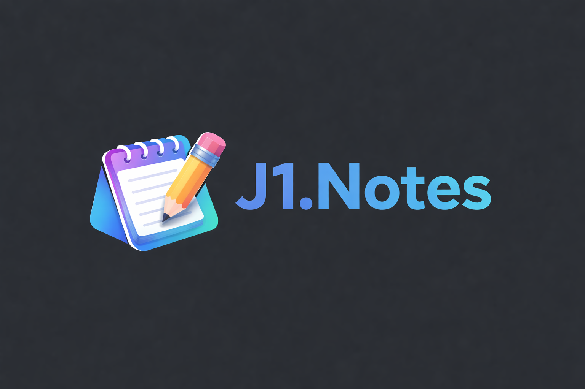
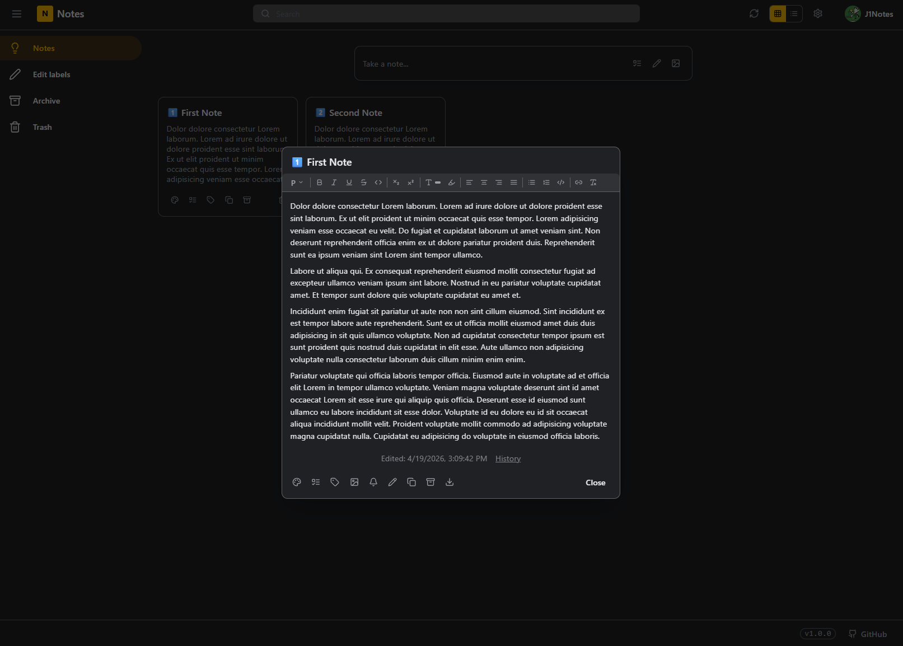

<div align="center">



# J1.Notes

**Self-hosted, privacy-first notes — your data, your server.**

[](https://github.com/x3kim/J1.Notes/releases)
[](LICENSE)
[](https://nextjs.org)
[](https://hub.docker.com)
[](https://www.typescriptlang.org)

</div>

---

J1.Notes is a self-hosted note-taking app inspired by Google Keep. It runs entirely on your own infrastructure — no accounts, no cloud, no tracking. Write notes, organize them with labels, attach images, draw sketches, and set reminders. Everything stays on your server.

## Features

| | Feature | Description |
|---|---|---|
| ✏️ | **Rich text editor** | Bold, italic, underline, highlights, links, text color, alignment |
| ✅ | **Checklists** | Drag-and-drop reorderable to-do lists |
| 🎨 | **Drawing** | Freehand sketch pad per note |
| 🖼️ | **Image attachments** | Attach photos and screenshots to notes |
| 🏷️ | **Labels** | Color-coded tags for organizing notes |
| 🔔 | **Reminders** | In-app browser notifications at a set time |
| 📌 | **Pin notes** | Keep important notes at the top |
| 🗂️ | **Archive & Trash** | Soft-delete with 7-day auto-purge |
| 🕓 | **Version history** | Automatic snapshots of significant edits |
| 🎨 | **Themes** | 4 built-in themes — dark, light, sepia, midnight |
| 🌍 | **Multi-language** | English, German, French |
| 📱 | **PWA** | Install as a desktop or mobile app |
| 🔒 | **App lock** | Optional password or PIN protection |
| 📄 | **REST API** | Full OpenAPI 3 spec, Swagger UI at `/api/docs` |
| 🐳 | **Docker-ready** | Single `docker compose up` deployment |
| 🗄️ | **SQLite & PostgreSQL** | Choose your database backend |

## Screenshot



## Quick Start

```bash
# 1. Clone the repository
git clone https://github.com/x3kim/J1.Notes.git
cd J1.Notes

# 2. Start (SQLite — simplest)
docker compose up -d

# 3. Open in your browser
open http://localhost:3000
```

> Data is stored in a named Docker volume (`j1notes_data`) and survives container restarts.

### PostgreSQL

```bash
docker compose -f docker-compose.postgres.yml up -d
```

### Local development

```bash
# Prerequisites: Node.js 20+
npm install
npx prisma db push
npm run dev        # http://localhost:3000
```

## Configuration

All settings are passed as environment variables. Copy `.env.example` to `.env` and adjust:

| Variable | Default | Description |
|---|---|---|
| `PORT` | `3000` | HTTP port |
| `JWT_SECRET` | *(insecure)* | **Required in production.** Secret for session tokens |
| `DATABASE_PROVIDER` | `sqlite` | `sqlite` or `postgresql` |
| `DATABASE_URL` | `file:/data/j1notes.db` | Database connection string |
| `SMTP_HOST` | — | SMTP server for password-reset emails |
| `SMTP_PORT` | `587` | SMTP port |
| `SMTP_SECURE` | `false` | `true` for port 465 / TLS |
| `SMTP_USER` | — | SMTP login username |
| `SMTP_PASS` | — | SMTP login password |
| `SMTP_FROM` | `J1.Notes <no-reply@j1notes.local>` | From address |
| `NEXT_PUBLIC_GITHUB_URL` | `https://github.com/x3kim/J1.Notes` | GitHub link in footer |

### Minimal production `.env`

```env
JWT_SECRET=your-very-long-random-secret-here
DATABASE_URL=file:/data/j1notes.db
```

## API

J1.Notes ships with an interactive **Swagger UI** at `/api/docs`.

The raw OpenAPI 3.1 spec is at `/api/docs?format=yaml`.

| Method | Endpoint | Description |
|---|---|---|
| `GET/POST` | `/api/notes` | List / create notes |
| `GET/PATCH/DELETE` | `/api/notes/:id` | Get / update / delete a note |
| `PATCH` | `/api/notes/:id/checklist/:itemId` | Toggle checklist item |
| `GET` | `/api/notes/:id/versions` | Version history |
| `GET/POST` | `/api/labels` | List / create labels |
| `PATCH/DELETE` | `/api/labels/:id` | Update / delete label |
| `POST` | `/api/auth/login` | Log in |
| `POST` | `/api/auth/logout` | Log out |
| `POST` | `/api/auth/forgot-password` | Request password reset |
| `POST` | `/api/auth/reset-password` | Reset password |
| `GET/PATCH` | `/api/profile` | Profile (username, avatar) |
| `POST/DELETE` | `/api/avatar` | Avatar upload / delete |
| `POST/DELETE` | `/api/upload` | File upload / delete |
| `GET/POST` | `/api/settings/auth` | Auth settings |

## Architecture

```
J1.Notes
├── src/
│   ├── app/
│   │   ├── api/              # Next.js Route Handlers (REST API)
│   │   ├── uploads/          # Runtime file serving
│   │   ├── login/
│   │   ├── reset-password/
│   │   └── page.tsx          # Main notes board
│   ├── components/           # React UI components
│   └── lib/
│       ├── db.ts             # Prisma client singleton
│       ├── email.ts          # SMTP / nodemailer
│       ├── i18n/             # Internationalization (i18next)
│       └── themes/           # Theme system
├── prisma/
│   ├── schema.prisma         # SQLite schema
│   └── schema.postgres.prisma
├── public/
│   ├── api/openapi.yaml      # OpenAPI 3.1 spec
│   └── locales/              # Translation files (en, de, fr)
├── .env.example
├── Dockerfile
├── docker-compose.yml             # SQLite deployment
└── docker-compose.postgres.yml    # PostgreSQL deployment
```

**Stack:** Next.js 15 · React 19 · TypeScript · Prisma ORM · SQLite / PostgreSQL · Tiptap · Tailwind CSS · Docker

## Updating

```bash
docker compose pull
docker compose up -d
```

Your data volume is preserved automatically.

## Security

- **Change `JWT_SECRET`** before exposing the app to the internet.
- App lock (password / PIN) is recommended for shared servers.
- File uploads are validated for MIME type and size server-side.
- All HTML content is sanitized with DOMPurify before storage.
- All database queries go through Prisma (no raw SQL injection surface).

## Contributing

Pull requests are welcome. Please open an issue first for large changes.

```bash
npm run dev          # development server
npm run lint         # ESLint
npm test             # Jest unit tests
npm run test:coverage
```

## License

MIT © [x3kim](https://github.com/x3kim)
